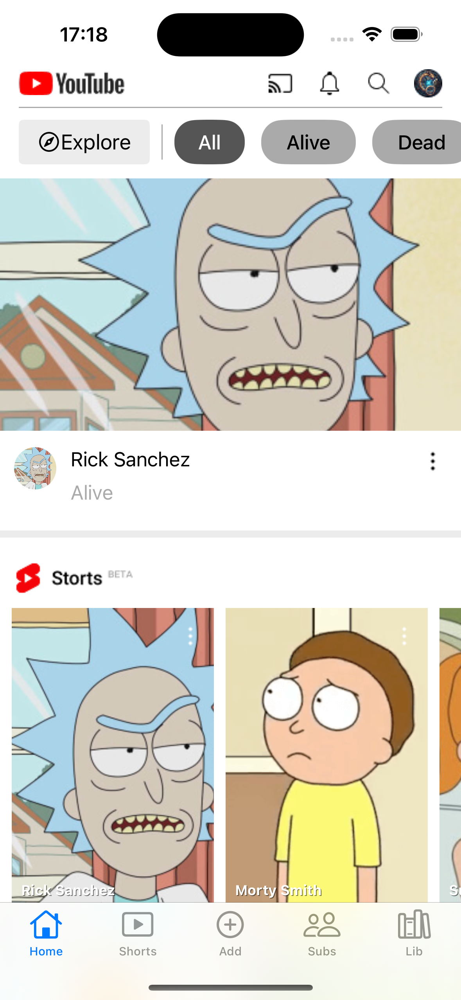
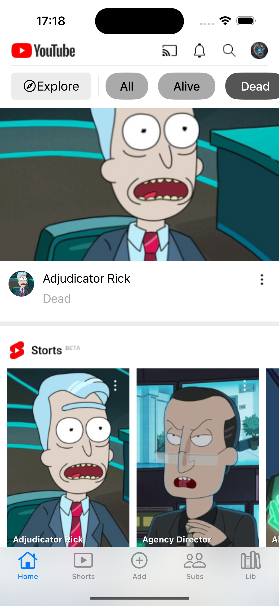
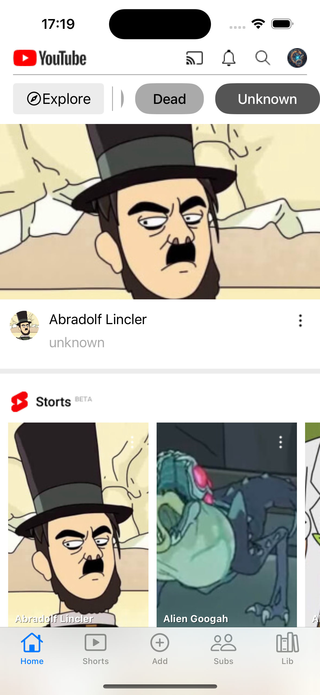
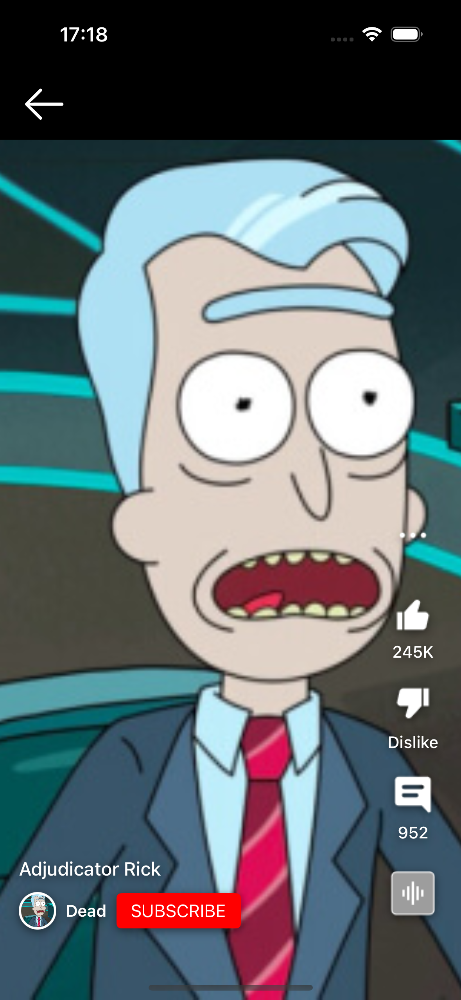

## 📷 Скриншоты

  
  
  
  

**Описание:**

- Скролл кнопок фильтра
- Загрузка персонажей с рик и морти апи
- Сортировка по статусу персонажа
- Скролл шортсов на главном экране горизонтальный
- При тапе на шортс на главном экране открывается экран с шортсами

## 🚀 Установка

1. Клонируйте репозиторий:
   
git clone https://github.com/JLNap/youtubeClone.git

2. Откройте проект в Xcode.
